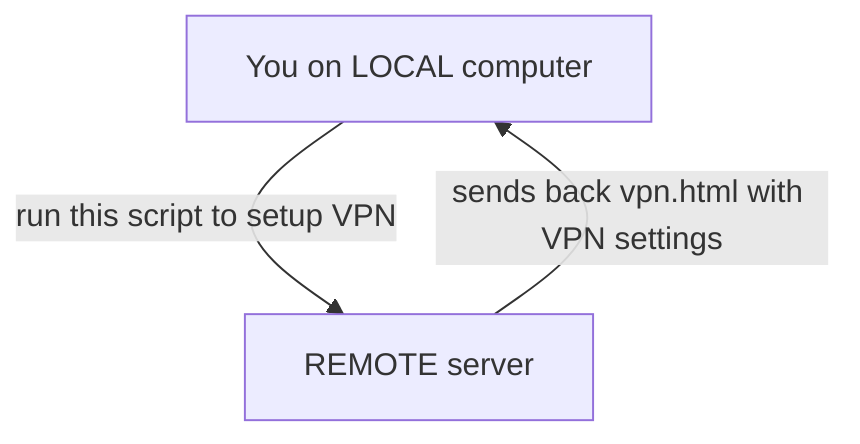

# Prerequisites
- remote server on Ubuntu OS(tested on versions: 18, 20, 22) - can be ported to other distros later
- remote server credentials: ip-address, login and password
- [docker](https://www.docker.com/) installed to your local computer

# Instructions

1. Download this repo on your local computer and open root folder
2. Fill `settings.yml` according to comments
3. Run from command-line in current folder `docker run --rm -v $(pwd):/data --network=host cytopia/ansible:latest-infra ansible-playbook vpn-playbook.yml -i settings.yml`
> If you need to reinstall the vpn on same server - it's easier to make fresh os installation via your server hosting management console. 
> Other ways require more experience with ssh, ansible, docker and linux
## Improvements
1. More services should be handled via docker - it makes em easily portable to other distros. Main blocker here are docker image autoupdate possibility - there's only few official docker images for the services required
2. Port to other distros
3. Speed up - data structure loading is implemented often in not optimal ways
